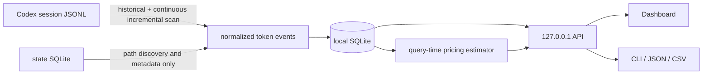

<div align="center">

# Codex Usage Dashboard

**See where your Codex tokens went, how caching helped, and what the same usage would cost at Standard API prices.**

*看清 Codex Token 花在哪里、缓存如何利用，以及折算成 Standard API 价格大约是多少。*

[English](README.en.md) · [简体中文](README.md)

[](https://github.com/edisoncccc/codex-usage/actions/workflows/ci.yml)
[](https://go.dev/)
[](#privacy-boundaries)
[](LICENSE)

</div>


> [!NOTE]
> This is a community-maintained GitHub Fork of [zJay26/codex-usage](https://github.com/zJay26/codex-usage), released under the [MIT License](LICENSE). This Fork adds clearer Subagent attribution, fork-replay protection, Cached Rate, itemized cost, and less intrusive data-quality notices. It is currently source-only: no prebuilt Release or EXE is provided.

`codex-usage` remains the command name for Codex Usage Dashboard. It turns local Codex usage on the current computer into a searchable Dashboard that answers four questions: where tokens went, which Agent produced them, how caching helped, and what the usage would cost at public Standard API rates.

## Understand it in 12 seconds


> The demo uses synthetic data only. The scanner streams through JSONL and selectively parses only records needed for statistics, such as metadata, task boundaries, and `token_count`; it neither parses nor persists prompt, response, reasoning, or tool-output bodies, and it never reads or parses `auth.json`.

## Four questions answered

| What matters | How the Dashboard answers |
|---|---|
| Local data and privacy | Scans Codex session JSONL on the current computer, writes derived statistics to local SQLite, and serves the UI on `127.0.0.1`; there is no central server, cloud sync, or cross-device aggregation |
| Token attribution | Attributes the same token set by model, project, Thread, Session, and Agent; distinguishes main tasks, Subagents, Guardian, and Memory, and gives an untitled Subagent its parent task title as a readable label |
| Cache utilization | Shows Input, Cached Input, Cache Write, Output, and Cached Rate separately. `Input` includes cache-related input; Regular Input is `max(Input - Cached Input - Cache Write, 0)`. Cached Rate is `Cached Input / Input`, or `—` when Input is zero |
| Standard API-equivalent cost | Applies separate rates to Regular Input, Cached Input, Cache Write, and Output, then shows pricing coverage. This is a public-price equivalent for local tokens—not an OpenAI bill, ChatGPT subscription allowance, or account quota |

## Start from source

This repository is currently a source-only distribution. Go 1.26+ is required (see [`go.mod`](go.mod)); no prebuilt Release or EXE is provided or linked.

Windows PowerShell:

```powershell
go test ./...
$env:CGO_ENABLED = "0"
go build -trimpath -o codex-usage.exe ./cmd/codex-usage
.\codex-usage.exe install
```

Linux bash:

```bash
go test ./...
CGO_ENABLED=0 go build -trimpath -o codex-usage ./cmd/codex-usage
./codex-usage install
```

Installation discovers existing Codex usage on this computer and keeps it updated incrementally in the background. From the source directory, run `.\codex-usage.exe` on Windows or `./codex-usage` on Linux to open the Dashboard. Use bare `codex-usage` only when the installation directory is already on `PATH`. For English CLI output, run the current build as follows:

```text
.\codex-usage.exe --lang en install
./codex-usage --lang en install
```

On a headless Linux server, Codex Usage prints an SSH tunnel command. Run it from your own computer, then open `http://127.0.0.1:43189`.

## Capabilities and boundaries

| Question | What codex-usage shows |
|---|---|
| Which machine used the tokens? | Separate statistics for each Windows, WSL, or Linux host, without mixing in other computers on the account |
| Which models and token categories drove usage? | Model plus Input, Cached, Cache Write, Output, and Reasoning composition |
| Which work drove it? | Attribution views for project, Thread, Session, main task, Subagent, Guardian, and Memory |
| When did it happen? | Today, 7 days, 30 days, all time, and single-day details |
| What did one Session use? | Session-level tokens and API-equivalent cost, with search and a one-click “Only this Session” filter |
| What would all of this roughly cost at API rates? | Overall and itemized API-equivalent cost, plus explicit pricing coverage |

| Counts | Out of scope or never persisted |
|---|---|
| Tokens, models, sources, projects, Threads, Sessions, Agents, and calendar days on this machine | Usage from other machines on the account |
| Existing and newly added local Codex session usage | Account quota, subscription balance, or real bills |
| Standard API text-token equivalent cost and pricing coverage | Prompt, response, reasoning, and tool-output bodies are neither parsed nor persisted; `auth.json` is never read or parsed |
| Data-quality notices for duplicates, resets, malformed records, and rebuilds | Cloud sync, remote telemetry, or third-party analytics |

> “Machine” means the host running Codex and `codex-usage`, not a remote target used by a shell or tool. Codex's official `/usage` shows account-level activity; this project adds detailed attribution only for the current computer.

<details><summary>View static desktop and 390 × 844 mobile screenshots made with synthetic data</summary>


</details>

## How it works: technical details

`codex-usage` is one Go binary containing the JSONL scanner, SQLite store, local API, and Web Dashboard.

During an upgrade, the installer removes only a legacy OTel exporter marked by codex-usage itself. It never rewrites third-party exporters, and Codex does not need to restart.



### Historical scan

The tool reads the current machine's `CODEX_HOME`. It first discovers canonical session metadata from the Codex state database, then streams JSONL files under `sessions/` and `archived_sessions/`.

Codex session usage is cumulative. At **each** `token_count` record, the scanner subtracts the previous cumulative vector and assigns that delta to the record timestamp's local calendar day. It never moves an entire multi-day session to the session's latest update date. Stable event IDs and cursors keep repeated scans idempotent. The scanner streams through JSONL and selectively retains and parses only records needed for statistics, including `session_meta`, `turn_context`, `task_started`, and `token_count`. For large prompt, response, reasoning, and tool-output records, it retains only a fixed-size type probe instead of allocating a buffer as long as the full line, and it neither parses the body nor writes it to the database.

The Codex state database is used only to discover rollout paths and enrich titles, projects, and other metadata. Its `tokens_used` value never changes token totals. OpenAI's [`account/usage/read`](https://learn.chatgpt.com/docs/app-server#7-token-usage-chatgpt) is service-backed account activity; this tool counts only current-machine local JSONL, so the scopes differ.

### JSONL deduplication and fork ownership

- In a fork file, the first `session_meta` fixes the physical file's child owner; a later copied parent `session_meta` cannot overwrite it.
- A modern multi-agent rollout writes child metadata, a copied parent `session_meta`, the complete parent transcript replay, and then the child's first UUIDv7 `task_started`, which ends the replay. Until that boundary appears, the replay stays pending; once complete, the entire prefix only establishes the cumulative baseline and is not counted as new child usage.
- A legacy rollout writes child metadata, parent token snapshots, and then copied parent metadata. That parent metadata closes the replay prefix and preserves its offset and cumulative baseline.
- A resumed session uses a session-wide cumulative high-water mark, so repeated cumulative snapshots do not create new events.
- If a same-total snapshot corrects Cached Input, Cache Write, Reasoning, or another category, the original event is corrected instead of treating the snapshot as a duplicate.

### File and calendar stability

Every scan unions paths from the state database with `sessions/` and `archived_sessions/`, so a missing state row cannot hide a JSONL file. Ordinary Windows paths and `\\?\` extended paths normalize to one file. Truncation, a rewrite inside the scanned range, a newly completed fork-replay boundary, or a parser upgrade preserves the current statistics and requests a rebuild. Derived indexes are cleared only after confirmation in the Dashboard or an explicit `codex-usage scan --rebuild`, then rebuilt from the JSONL files that still exist. Data from deleted JSONL files may no longer be recoverable at that point.

Each event stores its local date and hour at ingestion, so changing the system timezone later does not move existing history at query time. Repeated data-quality records are grouped by kind and local path; cumulative resets, malformed records, invalid timestamps, and rebuild requests remain visible.

### Local service

The service scans once on startup, then checks only JSONL size and modification time every 30 seconds. It runs an incremental scan after a change and a fallback scan every 10 minutes. Dashboard reads use a separate read-only SQLite pool, so ingestion no longer queues every page query behind one connection. There is no central server or cross-machine sync.

The Dashboard has three first-level views: Overview, Daily, and Details. Overview defaults to the last seven local calendar days. Daily fills zero-usage dates and supports calendar drill-down. Details shows one attribution dimension—model, source, agent, project, or thread—at a time.

Display settings in the header use a more comfortable type scale by default and let you adjust font size, display density, color theme, interface motion, and language with an immediate preview. These preferences stay in the current browser and never change usage data or exports.

### Standard API-equivalent cost

The estimator streams normalized events that already passed source de-duplication and attribution filtering. It runs at query time, writes no cost data to SQLite, and leaves existing token totals unchanged. Arithmetic uses fixed-point nano-USD. Regular Input is `max(Input - Cached Input - Cache Write, 0)`; the four cost components use the rates for Regular Input, Cached Input, Cache Write, and Output respectively. Reasoning is already included in Output and is not charged twice. The overview's Cached Rate is `Cached Input / Input`, showing the cached share of total Input.

Bundled Standard text prices were checked on **2026-08-04**. All values are USD / 1M tokens:

| Model | Input | Cached | Cache Write | Output |
|---|---:|---:|---:|---:|
| [GPT-5.6 Sol](https://developers.openai.com/api/docs/models/gpt-5.6-sol) | 5.00 | 0.50 | 6.25 | 30.00 |
| [GPT-5.6 Terra](https://developers.openai.com/api/docs/models/gpt-5.6-terra) | 2.00 | 0.20 | 2.50 | 12.00 |
| [GPT-5.6 Luna](https://developers.openai.com/api/docs/models/gpt-5.6-luna) | 0.20 | 0.02 | 0.25 | 1.20 |
| [GPT-5.5](https://developers.openai.com/api/docs/models/gpt-5.5) | 5.00 | 0.50 | not published | 30.00 |
| [GPT-5.4](https://developers.openai.com/api/docs/models/gpt-5.4) | 2.50 | 0.25 | not published | 15.00 |
| [GPT-5.4 mini](https://developers.openai.com/api/docs/models/gpt-5.4-mini) | 0.75 | 0.075 | not published | 4.50 |
| [GPT-5.3-Codex](https://developers.openai.com/api/docs/models/gpt-5.3-codex) | 1.75 | 0.175 | not published | 14.00 |
| [GPT-5.2-Codex](https://developers.openai.com/api/docs/models/gpt-5.2-codex) | 1.75 | 0.175 | not published | 14.00 |

GPT-5.6 Cache Write uses the official 1.25× regular Input rule. Local JSONL stores cumulative token activity and cannot reliably reconstruct the per-request boundaries used for API billing, so the estimator reports an equivalent value using the Standard base rates above and does not infer long-context multipliers. The UI always shows estimated cost together with token pricing coverage; unknown models are never treated as zero-cost.

Internal models can be explicitly mapped to one built-in public model or assigned custom rates in the Dashboard. Overrides take effect without restarting:

```json
{
  "pricing_overrides": {
    "codex-auto-review": { "alias_of": "gpt-5.6-luna" },
    "internal-model": {
      "input_usd_per_million": "1.00",
      "cached_input_usd_per_million": "0.10",
      "cache_write_input_usd_per_million": "1.25",
      "output_usd_per_million": "6.00"
    }
  }
}
```

The loopback API exposes `GET /api/v1/cost-estimate`, `GET /api/v1/pricing`, and `PUT /api/v1/pricing/overrides`. Pricing ships inside the binary; the running app never fetches price pages.

## Common commands

The examples below assume the installation directory is already on `PATH`.

```text
codex-usage                         Open the Dashboard
codex-usage summary --since 7d     Show a 7-day summary
codex-usage summary --since 30d --json
codex-usage summary --since all --csv
codex-usage scan                    Incremental historical scan
codex-usage scan --rebuild          Rebuild historical scan data
codex-usage doctor                  Check paths, JSONL sources, and service
codex-usage config add-home PATH    Add another CODEX_HOME
codex-usage uninstall               Remove the app, keep the database
codex-usage uninstall --purge       Remove the app and local data
```

The Dashboard supports `?lang=en|zh-CN` and its header language button. The URL wins over the saved locale, followed by the browser locale. The CLI supports global `--lang` and `CODEX_USAGE_LANG`, for example `codex-usage --lang en doctor`. `--json` and `--csv` fields never change with language.

## Local data paths

| Data | Windows | Linux |
|---|---|---|
| Codex Home | `%USERPROFILE%\.codex` | `~/.codex` |
| codex-usage state | `%LOCALAPPDATA%\codex-usage` | `${XDG_DATA_HOME:-~/.local/share}/codex-usage` |
| Installed binary | `%LOCALAPPDATA%\Programs\codex-usage\codex-usage.exe` | `~/.local/bin/codex-usage` |
| SQLite | `...\codex-usage\usage.sqlite` | `.../codex-usage/usage.sqlite` |

`CODEX_USAGE_HOME` overrides the app state directory. Do not synchronize this directory between machines, or the per-machine boundary becomes unreliable.

`usage.sqlite` is created automatically when installation, service startup, scanning, or a query first opens the store, then persists in the state directory above. The embedded pure-Go SQLite driver requires no separately installed SQLite server, Python, Docker, or CGO. The current user only needs write access to the state directory and sufficient disk space. Prefer a local disk; do not place the active database on cloud-sync folders, network shares, or a directory written by multiple machines.

## Privacy boundaries

- never reads or parses `auth.json`
- streams through each session JSONL record but selectively parses only metadata, task boundaries, `token_count`, and other records needed for statistics; prompt, response, reasoning, and tool-output bodies are neither parsed nor persisted
- never stores a Codex account ID
- uses no CDN; frontend assets are embedded
- refuses to listen outside `127.0.0.1`
- never reads actual OpenAI billing or ChatGPT rate-limit/account quota; it only estimates Standard API-equivalent cost for this machine
- embeds its pricing catalog and makes no external network request for estimation

Full local project paths and thread titles are retained for attribution, so JSON/CSV exports may contain that local metadata.

## Development and validation

The source workflow near the top covers local testing, building, and installation. Maintainers can also run the repository scripts to build every target:

```powershell
# Windows
.\scripts\build.ps1
```

```bash
# Linux
./scripts/build.sh
```

Dashboard tests:

```bash
npm ci
npx playwright install chromium
npm test
```

By default, `npm test` builds and launches a real Go binary in a temporary directory. Set `CODEX_USAGE_BIN` to reuse an existing build.

See [ACCEPTANCE.md](ACCEPTANCE.md) for validation results, [CONTRIBUTING.md](CONTRIBUTING.md) before opening an issue, and [SECURITY.md](SECURITY.md) for private vulnerability reporting.

## Known boundaries

- This release does not aggregate multiple machines; open each machine's Dashboard separately
- JSONL that is permanently deleted or damaged cannot be fabricated from state `tokens_used` or account usage
- historical sessions cannot be reliably split after users synchronize one Codex Home across machines
- Codex `total` is displayed as reported; it is not an actual bill or account-quota measurement, and API-equivalent cost is only a current-price conversion of local tokens

## Fork improvements and upstream credit

Thank you to [zJay26/codex-usage](https://github.com/zJay26/codex-usage) and its contributors for the original project, complete data path, and MIT-licensed foundation. This Fork preserves upstream history and uses **Codex Usage Dashboard** as its public product name. The repository slug and command remain `codex-usage`, while the Go module path remains `github.com/zJay26/codex-usage`, for compatibility.

Regression tests cover the current differences:

- an untitled Subagent walks its parent chain for a readable task label, while an explicit title still wins
- copied parent history in a modern fork stays pending until real child work starts, preventing parent replay from being charged to the child
- the overview adds Cached Rate and four cost components: Regular Input, Cached Input, Cache Write, and Output
- `cumulative_reset` is quieted as handled only when the warning list is valid and its length matches the status count; API failure, truncation, or a count mismatch remains conservatively actionable

The current distribution is source-only and provides no prebuilt binaries. See [LICENSE](LICENSE) for copyright and licensing, and [THIRD_PARTY_NOTICES.md](THIRD_PARTY_NOTICES.md) for third-party attribution.

## License

[MIT](LICENSE) © Codex Usage contributors. Original-project and third-party attribution is preserved in [THIRD_PARTY_NOTICES.md](THIRD_PARTY_NOTICES.md).
