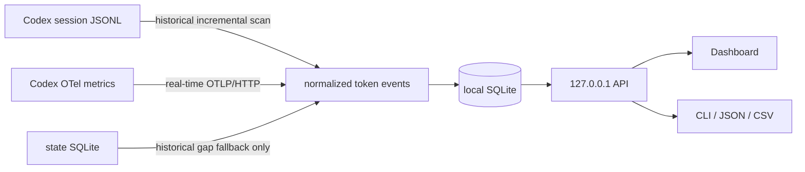

<div align="center">

# codex-usage

**Turn scattered local Codex records into clear, trustworthy per-machine token usage.**

English | [简体中文](README.md)

[](https://github.com/zJay26/codex-usage/actions/workflows/ci.yml)
[](https://github.com/zJay26/codex-usage/releases/latest)
[](https://go.dev/)
[](LICENSE)

</div>


## The problem it solves

Account-level usage cannot answer a practical question: **which computer used those tokens?**

When the same Codex account runs on a Windows workstation, a Linux server, or WSL, the account total mixes everything together. `codex-usage` runs independently on each host and shows:

- today's, 7-day, 30-day, and all-time usage for this machine
- usage by model, project, thread, source, and agent type
- historical sessions and future real-time metrics in one view
- visible warnings when attribution is incomplete instead of false precision

All data stays local. The tool does not read account credentials, store prompts or responses, or upload usage data.

## Highlights

| Capability | What you get |
|---|---|
| Per-machine accounting | A separate `machine_id` and SQLite database on every host |
| Historical import | Existing local Codex sessions are scanned on first install |
| Real-time metrics | Official Codex OTel metrics, refreshed every 60 seconds by default |
| Useful attribution | Filter by model, source, project, thread, main task, subagent, guardian, or memory |
| Honest gaps | Corrupt records, counter resets, and unattributed history stay visible |
| Local-first | Dashboard binds only to `127.0.0.1`; all frontend assets are embedded |
| Single binary | Windows and Linux, amd64 and arm64, no CGO or external database server |
| Export | JSON and CSV from both the CLI and Dashboard |

## Quick start

Download the correct file from the [latest Release](https://github.com/zJay26/codex-usage/releases/latest):

| Platform | amd64 / x64 | arm64 |
|---|---|---|
| Windows | `codex-usage-windows-amd64.exe` | `codex-usage-windows-arm64.exe` |
| Linux | `codex-usage-linux-amd64` | `codex-usage-linux-arm64` |

Windows:

```powershell
.\codex-usage-windows-amd64.exe install
```

Linux:

```bash
chmod +x codex-usage-linux-amd64
./codex-usage-linux-amd64 install
```

No administrator privileges are required. Installation creates the local database, scans historical sessions, adds a loopback OTel endpoint without overwriting an existing exporter, and starts a user-level background service. Restart Codex afterward so new Codex processes load the real-time metrics configuration.

Run `codex-usage` to open the Dashboard. On a headless Linux host, use the printed SSH tunnel command and open `http://127.0.0.1:43189` locally.

## How it works

`codex-usage` is one Go binary containing the collector, SQLite store, local API, and Web Dashboard.



### Historical scan

The tool reads the current machine's `CODEX_HOME`. It first discovers canonical session metadata from the Codex state database, then streams JSONL files under `sessions/` and `archived_sessions/`.

Codex session usage is cumulative. The scanner stores the previous cursor and token vector, then records only the delta. Repeated scans do not double count. Large prompt, response, reasoning, and tool-output records are skipped without loading the entire line into memory or writing content to the database.

### Real-time collection

The installer safely configures Codex to send official `turn.token_usage` metrics to:

```text
http://127.0.0.1:43189/v1/metrics
```

The receiver accepts OTLP/HTTP JSON on loopback only. It never exposes a public listener.

### Merge rules

- OTel is the machine total during known OTel coverage windows
- session JSONL fills time before OTel was enabled or while the receiver was offline
- state-database `tokens_used` only fills historical differences that cannot be assigned to a date
- project, thread, and session details are attribution views and are not added again to the machine total

The three sources are never blindly summed.

### Local service

The service scans once on startup and then incrementally every 60 seconds by default. The Dashboard and CLI query the same local SQLite database. There is no central server or cross-machine sync.

## Common commands

```text
codex-usage                         Open the Dashboard
codex-usage summary --since 7d     Show a 7-day summary
codex-usage summary --since 30d --json
codex-usage summary --since all --csv
codex-usage scan                    Incremental historical scan
codex-usage scan --rebuild          Rebuild historical scan data
codex-usage doctor                  Check paths, service, and coverage gaps
codex-usage config add-home PATH    Add another CODEX_HOME
codex-usage uninstall               Remove the app, keep the database
codex-usage uninstall --purge       Remove the app and local data
```

## Local data paths

| Data | Windows | Linux |
|---|---|---|
| Codex Home | `%USERPROFILE%\.codex` | `~/.codex` |
| codex-usage state | `%LOCALAPPDATA%\codex-usage` | `${XDG_DATA_HOME:-~/.local/share}/codex-usage` |
| Installed binary | `%LOCALAPPDATA%\Programs\codex-usage\codex-usage.exe` | `~/.local/bin/codex-usage` |
| SQLite | `...\codex-usage\meter.sqlite` | `.../codex-usage/meter.sqlite` |

`CODEX_USAGE_HOME` overrides the app state directory. Do not synchronize this directory between machines, or the per-machine boundary becomes unreliable.

## Privacy boundaries

- never reads or parses `auth.json`
- never stores prompts, responses, reasoning, or tool output
- never stores a Codex account ID
- uses no CDN; frontend assets are embedded
- refuses to listen outside `127.0.0.1`
- does not estimate API cost or ChatGPT rate-limit usage

Full local project paths and thread titles are retained for attribution, so JSON/CSV exports may contain that local metadata.

## Build from source

Go 1.26.x is required:

```bash
go test ./...
CGO_ENABLED=0 go build -trimpath -o codex-usage ./cmd/codex-usage
```

Build all four targets with `scripts/build.ps1` on Windows or `scripts/build.sh` on Linux.

Dashboard tests:

```bash
npm ci
npx playwright install chromium
go build -trimpath -o codex-usage ./cmd/codex-usage
CODEX_USAGE_BIN=./codex-usage npm test
```

See [ACCEPTANCE.md](ACCEPTANCE.md) for validation results, [CONTRIBUTING.md](CONTRIBUTING.md) before opening an issue, and [SECURITY.md](SECURITY.md) for private vulnerability reporting.

## Known boundaries

- v1 does not aggregate multiple machines; open each machine's Dashboard separately
- Codex OTel may omit thread IDs or cwd, so exact totals can coexist with JSONL-based attribution
- historical sessions cannot be reliably split after users synchronize one Codex Home across machines
- Codex `total` is displayed as reported; it is not a cost or account-quota estimate

## License

[MIT](LICENSE) © Codex Usage contributors
