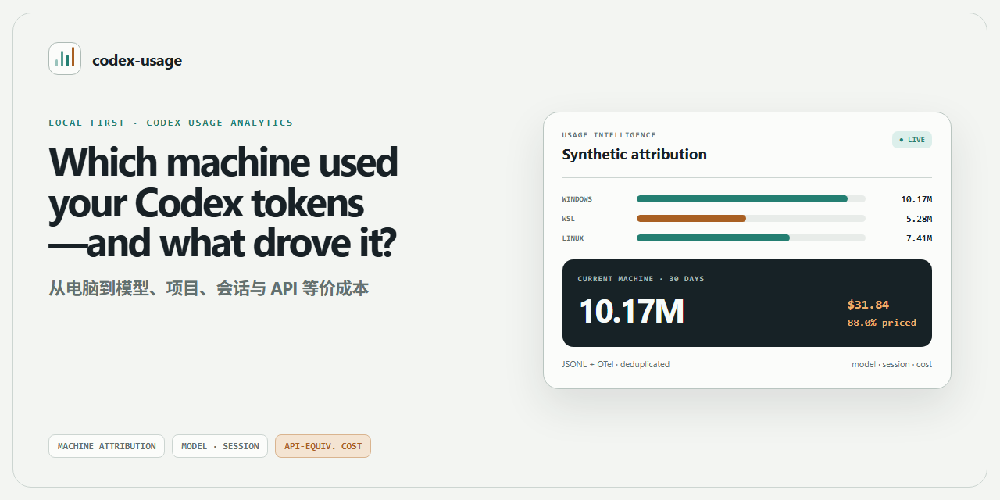
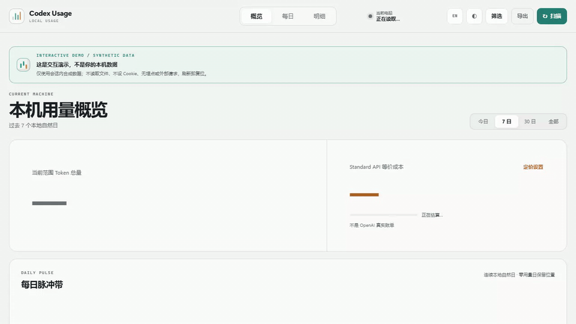
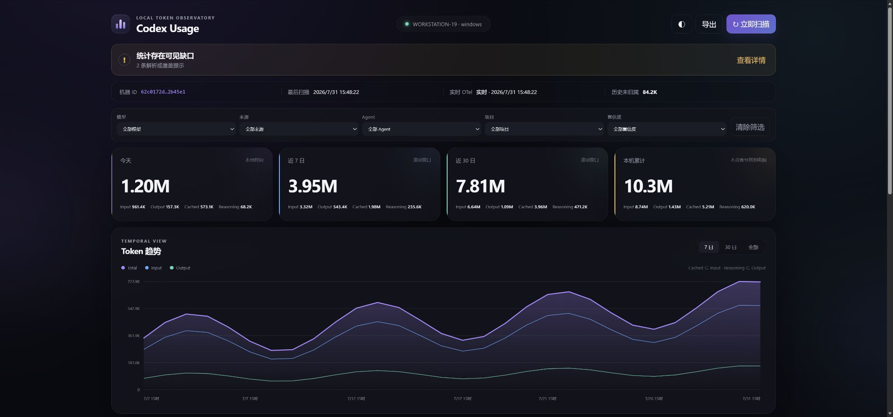
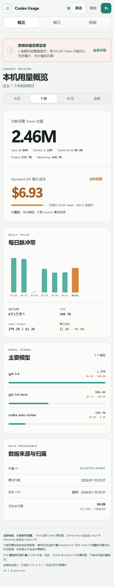
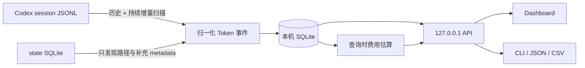

<div align="center">

# Codex Usage Dashboard

**看清 Codex Token 花在哪里、缓存如何利用，以及折算成 Standard API 价格大约是多少。**

*See where your Codex tokens went, how caching helped, and what the same usage would cost at Standard API prices.*

[简体中文](README.md) · [English](README.en.md)

[](https://github.com/edisoncccc/codex-usage/actions/workflows/ci.yml)
[](https://go.dev/)
[](#隐私边界)
[](LICENSE)

</div>



> [!NOTE]
> 这是基于 [zJay26/codex-usage](https://github.com/zJay26/codex-usage) 的社区维护 GitHub Fork，依照 [MIT License](LICENSE) 发布。当前 Fork 加入了更清晰的 Subagent 归属、fork 重放保护、Cached Rate、费用分项和更克制的数据质量提示。现阶段仅提供源码（source-only），不提供预编译 Release 或 EXE。

`codex-usage` 是 Codex Usage Dashboard 的命令名。它把当前电脑的本地 Codex 用量整理成可搜索的 Dashboard，回答四个问题：Token 用在什么项目与任务、由哪个 Agent 产生、缓存利用得怎样，以及按公开 Standard API 价格折算后的等价成本是多少。

## 12 秒看懂



> 演示只使用合成数据。项目不会读取或保存 prompt、回复、reasoning 内容、工具输出或 `auth.json`。

## 四件事说清楚

| 你关心的事 | Dashboard 如何回答 |
|---|---|
| 本地与隐私 | 只扫描当前电脑的 Codex session JSONL，把派生统计写入本机 SQLite，并通过 `127.0.0.1` 提供页面；没有中心服务器、云同步或跨设备汇总 |
| Token 去向 | 按模型、项目、Thread、Session 和 Agent 归属同一批 Token；可区分主任务、Subagent、Guardian 与 Memory，未显式命名的 Subagent 会继承父任务标题作为可读标签 |
| 缓存利用 | 分别展示 Input、Cached Input、Cache Write、Output 与 Cached Rate。`Input` 包含缓存相关输入，普通 Input 按 `max(Input - Cached Input - Cache Write, 0)` 计算；Cached Rate 为 `Cached Input / Input`，Input 为 0 时显示 `—` |
| Standard API 等价成本 | 使用普通 Input、Cached Input、Cache Write 和 Output 各自单价计算，并同时展示定价覆盖率；这是本机 Token 按公开价格的等价值，不是 OpenAI 账单、ChatGPT 订阅额度或账号配额 |

## 从源码开始使用

当前仓库是 source-only 发布。需要 Go 1.26+（以 [`go.mod`](go.mod) 为准）；不提供或链接任何预编译 Release / EXE。

Windows PowerShell：

```powershell
go test ./...
$env:CGO_ENABLED = "0"
go build -trimpath -o codex-usage.exe ./cmd/codex-usage
.\codex-usage.exe install
```

Linux / macOS bash：

```bash
go test ./...
CGO_ENABLED=0 go build -trimpath -o codex-usage ./cmd/codex-usage
./codex-usage install
```

安装会整理这台电脑已有的 Codex 使用记录，并在后台持续增量更新。之后运行 `codex-usage` 打开 Dashboard；英文 CLI 可使用：

```text
codex-usage --lang en install
```

Linux 服务器没有桌面环境时，程序会打印 SSH 隧道命令。在自己的电脑执行命令后访问 `http://127.0.0.1:43189`。

## 能力与边界

| 你想知道 | codex-usage 给出的视图 |
|---|---|
| 哪台电脑用了 Token？ | 每台 Windows、WSL 或 Linux 主机独立统计，不混入账号在其他电脑上的用量 |
| 用在了什么模型和内容类型？ | 模型及 Input、Cached、Cache Write、Output、Reasoning 构成 |
| 哪项工作驱动了用量？ | 项目、Thread、Session，以及主任务、Subagent、Guardian、Memory 的归属视图 |
| 什么时候发生？ | 今天、7 日、30 日、全部历史，以及按自然日查看详情 |
| 某段 Session 花了多少？ | Session 级 Token 与 API 等价费用；可搜索，也可一键只看当前 Session |
| 如果全部按 API 价格折算呢？ | 总体与分项的 API 等价费用，并明确显示有多少 Token 能够定价 |

| 会统计 | 不会统计或读取 |
|---|---|
| 当前电脑的 Token、模型、来源、项目、Thread、Session、Agent 和自然日 | 账号在其他电脑上的用量 |
| 本机已有以及之后新增的 Codex session 用量记录 | 账号配额、订阅余额或真实账单 |
| 按 Standard API 文本价格计算的等价费用和定价覆盖率 | prompt、回复、reasoning 内容、工具输出或 `auth.json` |
| 重复、回退、坏记录和文件重建等数据质量提示 | 云同步、远程遥测或第三方分析 |

> “电脑”指运行 Codex 客户端和 `codex-usage` 的主机，不是 shell 或 tool 实际执行的远程环境。Codex 官方 `/usage` 查看账号级活动；本项目只补充当前电脑上的详细归属。

<details><summary>查看使用合成数据的静态桌面和 390 × 844 移动端截图</summary>





</details>

## 工作原理与技术说明

`codex-usage` 是一个 Go 单文件程序，里面同时包含 JSONL 扫描器、SQLite、HTTP API 和 Web Dashboard。安装后，它以用户级后台服务运行。

升级时，安装器只会移除旧版由 codex-usage 自己标记的 OTel exporter，不会改写第三方 exporter，也无需重启 Codex。



### 1. 历史扫描

程序只读当前电脑的 `CODEX_HOME`。它优先从 Codex 状态库取得 session 路径、项目和 Thread 信息，再流式读取 `sessions/` 与 `archived_sessions/` 中的 JSONL。

每个 session 里的 Token 是累计值。程序在**每一条** `token_count` 记录处保存累计向量，用“本次累计值 - 上次累计值”得到这一次的增量，并把增量归到该条记录时间戳对应的本地自然日；不会按 session 的最后更新时间把整段历史塞到同一天。重复扫描仍由稳定事件 ID 与游标去重。超大的 prompt、回复和工具输出记录会被跳过，不会整行载入内存，也不会写进数据库。

Codex 状态库只用于发现 rollout 路径并补充标题、项目等 metadata；其中的 `tokens_used` 不参与 Token 总量。OpenAI 的 [`account/usage/read`](https://learn.chatgpt.com/docs/app-server#7-token-usage-chatgpt) 是服务端账号 Token 活动；本工具只统计当前电脑的本地 JSONL，两者范围不同。

### 2. JSONL 防重与 fork 识别

- 一个物理 JSONL 的 owner session 由第一条 `session_meta` 固定，后续复制进来的父 `session_meta` 不会改写归属
- `forked_from_id` 文件中“子线程 metadata → 父线程历史快照 → 父线程 metadata”这一前缀只建立累计基线，不计作子线程新消耗
- 同一 session 恢复到新文件时使用 session 级累计高水位；重复累计快照不会再次入账
- `total_tokens` 不变但 Cached Input、Cache Write、Reasoning 等分类被修正时，会修正原事件，而不是当作重复忽略

### 3. 文件与日期稳定性

扫描器每次都用状态库路径与 `sessions/`、`archived_sessions/` 目录取并集，避免状态库漏行。Windows 普通路径与 `\\?\` 扩展路径会归一为同一物理文件。检测到截断、原范围重写、后补出的 fork 重放边界或解析规则升级时，程序会保留现有统计并提示需要重建；只有用户在 Dashboard 明确确认，或显式运行 `codex-usage scan --rebuild` 后，才会清除派生索引并从当前仍存在的全部 JSONL 重建。已删除 JSONL 对应的数据届时可能无法恢复。

每个事件在入库时保存本地日期与小时，因此之后修改系统时区不会让既有历史在查询时换日。重复出现的同类数据质量记录会按“类型 + 本地路径”聚合；累计回退、坏记录、无效时间戳和待确认重建都会明确保留。

### 4. 展示与服务

后台服务启动时先扫描一次，之后每 30 秒只检查 JSONL 的文件大小与修改时间；检测到变化才执行增量扫描，无变化时每 10 分钟兜底扫描。Dashboard 使用独立只读连接查询同一个本机 SQLite，扫描写入不会再把页面查询堵在单一连接后。没有任何中心服务器，也没有跨电脑同步；要看两台电脑，就分别打开两台电脑的 Dashboard。

Dashboard 固定为“概览 / 每日 / 明细”三个一级视图。概览默认显示最近 7 个本地自然日；每日视图补齐零用量日期并支持月历下钻；明细视图一次只展开模型、来源、Agent、项目或 Thread 中的一个维度。

页头“显示设置”默认采用更舒适的字号层级，并可即时调整字体大小、显示密度、颜色主题、界面动效和语言。所有显示偏好只保存在当前浏览器，不会影响统计数据或导出结果。

### 5. Standard API 等价成本

费用在查询时流式读取已经过去重、归属规则筛选后的规范事件，不写入 SQLite，也不会改变原有 Token 统计。计算使用定点 nano-USD：普通 Input 是 `max(Input - Cached Input - Cache Write, 0)`，四个费用分项分别使用普通 Input、Cached Input、Cache Write 和 Output 的单价；Reasoning 已包含在 Output 中，不会重复收费。概览里的 Cached Rate 则是 `Cached Input / Input`，用于观察总 Input 中的缓存占比。

内置 Standard 文本价格核对日期为 **2026-08-04**，单位均为 USD / 1M Token：

| 模型 | Input | Cached | Cache Write | Output |
|---|---:|---:|---:|---:|
| [GPT-5.6 Sol](https://developers.openai.com/api/docs/models/gpt-5.6-sol) | 5.00 | 0.50 | 6.25 | 30.00 |
| [GPT-5.6 Terra](https://developers.openai.com/api/docs/models/gpt-5.6-terra) | 2.00 | 0.20 | 2.50 | 12.00 |
| [GPT-5.6 Luna](https://developers.openai.com/api/docs/models/gpt-5.6-luna) | 0.20 | 0.02 | 0.25 | 1.20 |
| [GPT-5.5](https://developers.openai.com/api/docs/models/gpt-5.5) | 5.00 | 0.50 | 未公开 | 30.00 |
| [GPT-5.4](https://developers.openai.com/api/docs/models/gpt-5.4) | 2.50 | 0.25 | 未公开 | 15.00 |
| [GPT-5.4 mini](https://developers.openai.com/api/docs/models/gpt-5.4-mini) | 0.75 | 0.075 | 未公开 | 4.50 |
| [GPT-5.3-Codex](https://developers.openai.com/api/docs/models/gpt-5.3-codex) | 1.75 | 0.175 | 未公开 | 14.00 |
| [GPT-5.2-Codex](https://developers.openai.com/api/docs/models/gpt-5.2-codex) | 1.75 | 0.175 | 未公开 | 14.00 |

GPT-5.6 的 Cache Write 使用官方“普通 Input 的 1.25 倍”规则。本机 JSONL 保存的是累计 Token 活动，不能可靠还原 API 账单中的逐请求边界，因此工具统一展示上表 Standard 基础单价的等价值，不推断长上下文倍率。页面始终同时展示费用和 Token 定价覆盖率，未知模型不会被当成零费用。

内部模型可以在 Dashboard 的“定价设置”中映射到一个明确的内置公开模型，或填写自定义单价。等价配置如下，保存后无需重启：

```json
{
  "pricing_overrides": {
    "codex-auto-review": { "alias_of": "gpt-5.6-luna" },
    "internal-model": {
      "input_usd_per_million": "1.00",
      "cached_input_usd_per_million": "0.10",
      "cache_write_input_usd_per_million": "1.25",
      "output_usd_per_million": "6.00"
    }
  }
}
```

本机 API 提供 `GET /api/v1/cost-estimate`、`GET /api/v1/pricing` 和 `PUT /api/v1/pricing/overrides`。价格随二进制嵌入，运行时不会抓取网页。

## 常用命令

```text
codex-usage                         打开 Dashboard
codex-usage summary --since 7d     查看近 7 日摘要
codex-usage summary --since 30d --json
codex-usage summary --since all --csv
codex-usage scan                    增量扫描
codex-usage scan --rebuild          重建历史扫描数据
codex-usage doctor                  检查路径、JSONL 来源和服务
codex-usage config add-home PATH    添加额外 CODEX_HOME
codex-usage uninstall               卸载程序，保留统计库
codex-usage uninstall --purge       卸载并删除统计数据
```

Dashboard 支持 `?lang=en|zh-CN` 和页头语言按钮；URL 参数优先于已保存语言，其次跟随浏览器。CLI 支持全局 `--lang` 和 `CODEX_USAGE_LANG`，例如 `CODEX_USAGE_LANG=en codex-usage doctor`。`--json` 与 `--csv` 字段不随语言改变。

## 数据存在哪里

| 内容 | Windows | Linux |
|---|---|---|
| Codex Home | `%USERPROFILE%\.codex` | `~/.codex` |
| codex-usage 状态 | `%LOCALAPPDATA%\codex-usage` | `${XDG_DATA_HOME:-~/.local/share}/codex-usage` |
| 安装后的程序 | `%LOCALAPPDATA%\Programs\codex-usage\codex-usage.exe` | `~/.local/bin/codex-usage` |
| SQLite | `...\codex-usage\usage.sqlite` | `.../codex-usage/usage.sqlite` |

设置 `CODEX_USAGE_HOME` 可以覆盖工具自己的状态目录。不要在多台电脑之间同步这个目录，否则逐电脑边界会失真。

`usage.sqlite` 会在首次安装、启动服务、扫描或查询需要打开状态库时自动创建，并持续保存在上述状态目录。程序使用内嵌的纯 Go SQLite 驱动，不要求预装 SQLite、数据库服务、Python、Docker 或 CGO；只需要当前用户对状态目录有读写权限，并有足够磁盘空间。应优先使用本机磁盘，不建议把活动数据库放在网盘、网络共享或多台电脑共同写入的同步目录。

## 隐私边界

`codex-usage` 的边界是刻意收紧的：

- 不读取或解析 `auth.json`
- 不保存 prompt、回复、reasoning 或工具输出
- 不保存 Codex 账号 ID
- 不使用 CDN，页面资源全部离线内嵌
- 不监听 `127.0.0.1` 以外的地址
- 不读取 OpenAI 真实账单或 ChatGPT rate-limit / 账号配额；只提供当前电脑的 Standard API 等价成本估算
- 定价目录随二进制嵌入，运行时不会为费用功能访问外部网络

本机完整项目路径和 Thread 标题会用于归属视图，因此导出的 JSON/CSV 也可能包含这些本机信息。

## 开发与验证

首页的源码流程用于本机测试、构建和安装。维护者还可以运行仓库脚本构建全部目标：

```powershell
# Windows
.\scripts\build.ps1
```

```bash
# Linux
./scripts/build.sh
```

Dashboard 测试：

```bash
npm ci
npx playwright install chromium
npm test
```

`npm test` 默认在临时目录构建并启动真实 Go 二进制；设置 `CODEX_USAGE_BIN` 可以复用已有构建产物。

更多验收数据见 [ACCEPTANCE.md](ACCEPTANCE.md)。问题反馈前请阅读 [CONTRIBUTING.md](CONTRIBUTING.md)；涉及本机数据或路径的安全问题请按 [SECURITY.md](SECURITY.md) 私密报告。

## 已知边界

- 当前版本不做跨电脑聚合；每台机器独立查看
- JSONL 若被外部工具永久删除或损坏，缺失部分无法由 state `tokens_used` 或账号用量伪造补回
- 主动同步同一个 Codex Home 后，安装前的历史无法可靠拆回原始电脑
- `total` 按 Codex 原始值展示，不等于独立生成文字量、真实账单或账号配额；API 等价成本只是按当前价格对本机 Token 的重新折算

## Fork 改进与上游致谢

感谢 [zJay26/codex-usage](https://github.com/zJay26/codex-usage) 及其贡献者提供原始项目、完整的数据链路与 MIT 开源基础。本 Fork 保留上游历史，并将公开产品展示名设为 **Codex Usage Dashboard**；仓库 slug 与命令名仍为 `codex-usage`，Go module 路径仍为 `github.com/zJay26/codex-usage`，以维持兼容性。

当前差异经过回归测试覆盖：

- 未显式命名的 Subagent 会沿父级链查找任务标题，显式标题仍优先
- 现代 fork 的父任务重放历史保持 pending，直到真实子任务开始，避免把父历史计入子任务
- 概览增加 Cached Rate，以及普通 Input、Cached Input、Cache Write、Output 四项费用
- 只有警告列表结构有效且条数与状态计数一致时，`cumulative_reset` 才会静默归入“已处理”；API 失败、截断或计数不一致时仍保守地提示复核

当前只发布源码，不提供预编译二进制。版权与许可见 [LICENSE](LICENSE)，第三方组件声明见 [THIRD_PARTY_NOTICES.md](THIRD_PARTY_NOTICES.md)。

## License

[MIT](LICENSE) © Codex Usage contributors。原始项目与第三方归属按 [THIRD_PARTY_NOTICES.md](THIRD_PARTY_NOTICES.md) 保留。
