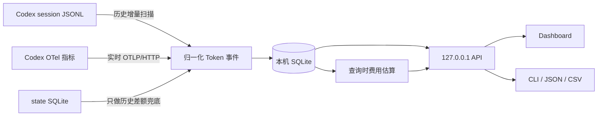

<div align="center">

# codex-usage

**把分散在本机的 Codex Token 记录，变成清楚、可信、可筛选的逐电脑用量。**

[English](README.en.md) | 简体中文

[](https://github.com/zJay26/codex-usage/actions/workflows/ci.yml)
[](https://github.com/zJay26/codex-usage/releases/latest)
[](https://go.dev/)
[](LICENSE)

</div>


<details><summary>查看 390 × 844 移动端布局</summary>


</details>

## 它解决什么问题

Codex 自带的账号级用量无法回答一个很实际的问题：**这些 Token 到底是哪台电脑用掉的？**

当同一个账号同时用于 Windows 工作站、Linux 服务器或 WSL 时，账号总量会混在一起。`codex-usage` 在每台机器上独立工作，为你提供：

- 当前电脑今天、近 7 日、近 30 日和累计用了多少 Token
- 每个本地自然日的用量月历、零用量日期和单日模型构成
- 哪个模型、项目、Thread 或 Agent 用得最多
- 按当前 Standard API 文本价格估算等价成本，并明确显示定价覆盖率
- 历史 session 与未来实时用量的统一视图
- 数据缺口和估算边界的明确提示，而不是给出一个看似精确的假数字

所有数据都留在本机。程序不读取账号凭据，不保存 prompt、回复、reasoning 或工具输出，也不会把统计结果上传到外部服务。

## 功能亮点

| 功能 | 你得到什么 |
|---|---|
| 逐电脑统计 | 每台机器生成独立 `machine_id` 和 SQLite 数据库，不把账号其他电脑混进来 |
| 历史补录 | 自动扫描本机 Codex session，安装后就能看到已有用量 |
| 实时采集 | 通过 Codex 官方 OTel 指标接收新用量，默认 60 秒刷新 |
| 清晰归属 | 按模型、来源、项目、Thread、主任务/Subagent/Guardian/Memory 筛选 |
| 每日下钻 | 连续自然日脉冲带、月历视图、零用量日与单日模型构成 |
| 等价成本 | 查询时按内置 Standard API 价格估算，未知 Token 单独计入未覆盖部分 |
| 可见缺口 | JSONL 损坏、累计回退、历史未归属等情况会明确显示 |
| 本地优先 | Dashboard 只监听 `127.0.0.1`，前端资源全部嵌入二进制 |
| 单文件部署 | Windows/Linux、amd64/arm64，无 CGO，不需要额外数据库服务 |
| 导出 | CLI 与 Dashboard 均支持 JSON/CSV 导出 |

## 快速开始

从 [最新 Release](https://github.com/zJay26/codex-usage/releases/latest) 下载与你的系统和架构对应的文件：

| 系统 | amd64 / x64 | arm64 |
|---|---|---|
| Windows | `codex-usage-windows-amd64.exe` | `codex-usage-windows-arm64.exe` |
| Linux | `codex-usage-linux-amd64` | `codex-usage-linux-arm64` |

### Windows

```powershell
.\codex-usage-windows-amd64.exe install
```

### Linux

```bash
chmod +x codex-usage-linux-amd64
./codex-usage-linux-amd64 install
```

安装不需要管理员权限。它会创建本机数据库、扫描历史 session、安全地添加本机 OTel endpoint，并启动用户级后台服务。安装完成后重启 Codex，让新启动的 Codex 进程加载实时采集配置。

Windows 使用当前用户的 `HKCU` 登录启动项：电脑重启并由同一用户登录后，后台服务会自动恢复，不需要再次手动运行安装程序。Linux 优先安装并启用 `systemd --user` 服务；如果系统没有可用的 user bus，安装器仍会启动当前后台进程并给出告警。无人值守 Linux 主机若希望用户退出登录后服务仍持续运行，需要管理员为该用户启用 linger。

升级旧版本时，安装器会先停止旧后台服务，再迁移原有配置、SQLite 数据库、WAL 数据和 OTel 管理标记。历史统计继续保留；新版本只创建和使用 `usage.sqlite`。

之后直接运行：

```text
codex-usage
```

程序会打开本机 Dashboard。Linux 服务器没有桌面环境时，会打印 URL 和 SSH 隧道命令：

```bash
ssh -N -L 43189:127.0.0.1:43189 user@server
```

再在本地浏览器访问 `http://127.0.0.1:43189`。

## 它是怎么运行的

`codex-usage` 是一个 Go 单文件程序，里面同时包含采集器、SQLite、HTTP API 和 Web Dashboard。安装后，它以用户级后台服务运行。



### 1. 历史扫描

程序只读当前电脑的 `CODEX_HOME`。它优先从 Codex 状态库取得 session 路径、项目和 Thread 信息，再流式读取 `sessions/` 与 `archived_sessions/` 中的 JSONL。

每个 session 里的 Token 是累计值。程序在**每一条** `token_count` 记录处保存累计向量，用“本次累计值 - 上次累计值”得到这一次的增量，并把增量归到该条记录时间戳对应的本地自然日；不会按 session 的最后更新时间把整段历史塞到同一天。重复扫描仍由稳定事件 ID 与游标去重。超大的 prompt、回复和工具输出记录会被跳过，不会整行载入内存，也不会写进数据库。

状态库中只有累计总量、没有事件时间的差额会保持“未归属日期”，只进入“全部”累计，不会被猜测或平均摊到某一天。OpenAI 的 [`account/usage/read`](https://learn.chatgpt.com/docs/app-server#7-token-usage-chatgpt) 是由 Codex 服务返回的 ChatGPT 账号 Token 活动与可选每日桶；本工具只统计当前电脑的本地来源，两者的范围并不相同，官方文档也没有规定每日桶与本地自然日必须使用相同的时区口径。

### 2. 实时采集

安装器会在不覆盖用户现有 exporter 的前提下，为 Codex 配置本机 OTLP/HTTP JSON endpoint：

```text
http://127.0.0.1:43189/v1/metrics
```

新启动的 Codex 进程把官方 `turn.token_usage` 指标发到这个地址。接收器只监听 loopback，外部机器无法直接访问。

### 3. 合并但不重复计算

- OTel 覆盖到的时间段，以 OTel 为机器总量
- OTel 启用前或离线期间，用 session JSONL 补位
- 状态库里的 `tokens_used` 只用于无法分配日期的历史差额
- 项目、Thread 和 session 明细来自本机 JSONL 归属信息，不会再次加到机器总量

这套规则避免把 OTel、JSONL 和状态库三份数据直接相加。

重复出现的同类数据质量记录会按“类型 + 本地路径”聚合，保留首次、最近时间和累计次数。`state_fallback_suppressed_otel` 表示防重规则成功阻止了状态库差额与 OTel 重复相加，属于审计信息，不计入需复核异常数；累计回退、坏记录或无效时间戳仍会明确保留。

### 4. 展示与服务

后台服务启动时先扫描一次，之后默认每 60 秒增量扫描。Dashboard 和 CLI 都查询同一个本机 SQLite。没有任何中心服务器，也没有跨电脑同步；要看两台电脑，就分别打开两台电脑的 Dashboard。

Dashboard 固定为“概览 / 每日 / 明细”三个一级视图。概览默认显示最近 7 个本地自然日；每日视图补齐零用量日期并支持月历下钻；明细视图一次只展开模型、来源、Agent、项目或 Thread 中的一个维度。

### 5. Standard API 等价成本

费用在查询时流式读取已经过去重、归属规则筛选后的规范事件，不写入 SQLite，也不会改变原有 Token 统计。计算使用定点 nano-USD：Cached Input 与 Cache Write 从 Input 中扣除，Reasoning 已包含在 Output 中，不会重复收费。

内置 Standard 文本价格核对日期为 **2026-07-31**，单位均为 USD / 1M Token：

| 模型 | Input | Cached | Cache Write | Output |
|---|---:|---:|---:|---:|
| [GPT-5.6 Sol](https://developers.openai.com/api/docs/models/gpt-5.6-sol) | 5.00 | 0.50 | 6.25 | 30.00 |
| [GPT-5.6 Terra](https://developers.openai.com/api/docs/models/gpt-5.6-terra) | 2.00 | 0.20 | 2.50 | 12.00 |
| [GPT-5.6 Luna](https://developers.openai.com/api/docs/models/gpt-5.6-luna) | 0.20 | 0.02 | 0.25 | 1.20 |
| [GPT-5.5](https://developers.openai.com/api/docs/models/gpt-5.5) | 5.00 | 0.50 | 未公开 | 30.00 |
| [GPT-5.4](https://developers.openai.com/api/docs/models/gpt-5.4) | 2.50 | 0.25 | 未公开 | 15.00 |
| [GPT-5.4 mini](https://developers.openai.com/api/docs/models/gpt-5.4-mini) | 0.75 | 0.075 | 未公开 | 4.50 |
| [GPT-5.3-Codex](https://developers.openai.com/api/docs/models/gpt-5.3-codex) | 1.75 | 0.175 | 未公开 | 14.00 |
| [GPT-5.2-Codex](https://developers.openai.com/api/docs/models/gpt-5.2-codex) | 1.75 | 0.175 | 未公开 | 14.00 |

GPT-5.6 的 Cache Write 使用官方“普通 Input 的 1.25 倍”规则。GPT-5.4、GPT-5.5 和 GPT-5.6 的单个精确事件在 Input 超过 272K 时应用长上下文倍率；只有累计总量或无法确认请求边界的部分保持未定价。页面始终同时展示费用和 Token 定价覆盖率，未知模型不会被当成零费用。

内部模型可以在 Dashboard 的“定价设置”中映射到一个明确的内置公开模型，或填写自定义单价。等价配置如下，保存后无需重启：

```json
{
  "pricing_overrides": {
    "codex-auto-review": { "alias_of": "gpt-5.6-luna" },
    "internal-model": {
      "input_usd_per_million": "1.00",
      "cached_input_usd_per_million": "0.10",
      "cache_write_input_usd_per_million": "1.25",
      "output_usd_per_million": "6.00"
    }
  }
}
```

本机 API 提供 `GET /api/v1/cost-estimate`、`GET /api/v1/pricing` 和 `PUT /api/v1/pricing/overrides`。价格随二进制嵌入，运行时不会抓取网页。

## 常用命令

```text
codex-usage                         打开 Dashboard
codex-usage summary --since 7d     查看近 7 日摘要
codex-usage summary --since 30d --json
codex-usage summary --since all --csv
codex-usage scan                    增量扫描
codex-usage scan --rebuild          重建历史扫描数据
codex-usage doctor                  检查路径、服务和数据缺口
codex-usage config add-home PATH    添加额外 CODEX_HOME
codex-usage uninstall               卸载程序，保留统计库
codex-usage uninstall --purge       卸载并删除统计数据
```

## 数据存在哪里

| 内容 | Windows | Linux |
|---|---|---|
| Codex Home | `%USERPROFILE%\.codex` | `~/.codex` |
| codex-usage 状态 | `%LOCALAPPDATA%\codex-usage` | `${XDG_DATA_HOME:-~/.local/share}/codex-usage` |
| 安装后的程序 | `%LOCALAPPDATA%\Programs\codex-usage\codex-usage.exe` | `~/.local/bin/codex-usage` |
| SQLite | `...\codex-usage\usage.sqlite` | `.../codex-usage/usage.sqlite` |

设置 `CODEX_USAGE_HOME` 可以覆盖工具自己的状态目录。不要在多台电脑之间同步这个目录，否则逐电脑边界会失真。

`usage.sqlite` 会在首次安装、启动服务、扫描或查询需要打开状态库时自动创建，并持续保存在上述状态目录。程序使用内嵌的纯 Go SQLite 驱动，不要求预装 SQLite、数据库服务、Python、Docker 或 CGO；只需要当前用户对状态目录有读写权限，并有足够磁盘空间。应优先使用本机磁盘，不建议把活动数据库放在网盘、网络共享或多台电脑共同写入的同步目录。

## 隐私边界

`codex-usage` 的边界是刻意收紧的：

- 不读取或解析 `auth.json`
- 不保存 prompt、回复、reasoning 或工具输出
- 不保存 Codex 账号 ID
- 不使用 CDN，页面资源全部离线内嵌
- 不监听 `127.0.0.1` 以外的地址
- 不读取 OpenAI 真实账单或 ChatGPT rate-limit / 账号配额；只提供当前电脑的 Standard API 等价成本估算
- 定价目录随二进制嵌入，运行时不会为费用功能访问外部网络

本机完整项目路径和 Thread 标题会用于归属视图，因此导出的 JSON/CSV 也可能包含这些本机信息。

## 从源码构建

需要 Go 1.26.x：

```bash
go test ./...
CGO_ENABLED=0 go build -trimpath -o codex-usage ./cmd/codex-usage
```

构建全部平台：

```powershell
# Windows
.\scripts\build.ps1
```

```bash
# Linux
./scripts/build.sh
```

Dashboard 测试：

```bash
npm ci
npx playwright install chromium
go build -trimpath -o codex-usage ./cmd/codex-usage
CODEX_USAGE_BIN=./codex-usage npm test
```

更多验收数据见 [ACCEPTANCE.md](ACCEPTANCE.md)。问题反馈前请阅读 [CONTRIBUTING.md](CONTRIBUTING.md)；涉及本机数据或路径的安全问题请按 [SECURITY.md](SECURITY.md) 私密报告。

## 已知边界

- v1 不做跨电脑聚合；每台机器独立查看
- Codex OTel 默认可能不带 Thread ID 或 cwd，此时总量仍准确，归属视图依赖同期 JSONL
- 主动同步同一个 Codex Home 后，安装前的历史无法可靠拆回原始电脑
- `total` 按 Codex 原始值展示，不等于独立生成文字量、真实账单或账号配额；API 等价成本只是按当前价格对本机 Token 的重新折算

## License

[MIT](LICENSE) © Codex Usage contributors
