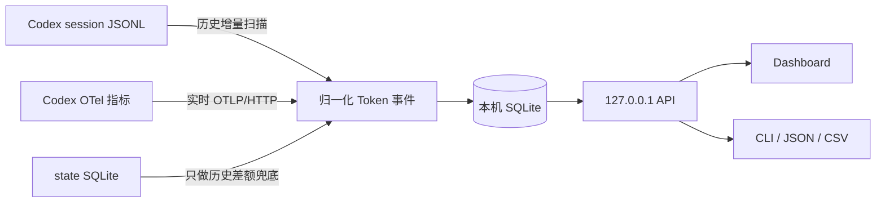

<div align="center">

# codex-usage

**把分散在本机的 Codex Token 记录，变成清楚、可信、可筛选的逐电脑用量。**

[English](README.en.md) | 简体中文

[](https://github.com/zJay26/codex-usage/actions/workflows/ci.yml)
[](https://github.com/zJay26/codex-usage/releases/latest)
[](https://go.dev/)
[](LICENSE)

</div>


## 它解决什么问题

Codex 自带的账号级用量无法回答一个很实际的问题：**这些 Token 到底是哪台电脑用掉的？**

当同一个账号同时用于 Windows 工作站、Linux 服务器或 WSL 时，账号总量会混在一起。`codex-usage` 在每台机器上独立工作，为你提供：

- 当前电脑今天、近 7 日、近 30 日和累计用了多少 Token
- 哪个模型、项目、Thread 或 Agent 用得最多
- 历史 session 与未来实时用量的统一视图
- 数据缺口和估算边界的明确提示，而不是给出一个看似精确的假数字

所有数据都留在本机。程序不读取账号凭据，不保存 prompt、回复、reasoning 或工具输出，也不会把统计结果上传到外部服务。

## 功能亮点

| 功能 | 你得到什么 |
|---|---|
| 逐电脑统计 | 每台机器生成独立 `machine_id` 和 SQLite 数据库，不把账号其他电脑混进来 |
| 历史补录 | 自动扫描本机 Codex session，安装后就能看到已有用量 |
| 实时采集 | 通过 Codex 官方 OTel 指标接收新用量，默认 60 秒刷新 |
| 清晰归属 | 按模型、来源、项目、Thread、主任务/Subagent/Guardian/Memory 筛选 |
| 可见缺口 | JSONL 损坏、累计回退、历史未归属等情况会明确显示 |
| 本地优先 | Dashboard 只监听 `127.0.0.1`，前端资源全部嵌入二进制 |
| 单文件部署 | Windows/Linux、amd64/arm64，无 CGO，不需要额外数据库服务 |
| 导出 | CLI 与 Dashboard 均支持 JSON/CSV 导出 |

## 快速开始

从 [最新 Release](https://github.com/zJay26/codex-usage/releases/latest) 下载与你的系统和架构对应的文件：

| 系统 | amd64 / x64 | arm64 |
|---|---|---|
| Windows | `codex-usage-windows-amd64.exe` | `codex-usage-windows-arm64.exe` |
| Linux | `codex-usage-linux-amd64` | `codex-usage-linux-arm64` |

### Windows

```powershell
.\codex-usage-windows-amd64.exe install
```

### Linux

```bash
chmod +x codex-usage-linux-amd64
./codex-usage-linux-amd64 install
```

安装不需要管理员权限。它会创建本机数据库、扫描历史 session、安全地添加本机 OTel endpoint，并启动用户级后台服务。安装完成后重启 Codex，让新启动的 Codex 进程加载实时采集配置。

之后直接运行：

```text
codex-usage
```

程序会打开本机 Dashboard。Linux 服务器没有桌面环境时，会打印 URL 和 SSH 隧道命令：

```bash
ssh -N -L 43189:127.0.0.1:43189 user@server
```

再在本地浏览器访问 `http://127.0.0.1:43189`。

## 它是怎么运行的

`codex-usage` 是一个 Go 单文件程序，里面同时包含采集器、SQLite、HTTP API 和 Web Dashboard。安装后，它以用户级后台服务运行。



### 1. 历史扫描

程序只读当前电脑的 `CODEX_HOME`。它优先从 Codex 状态库取得 session 路径、项目和 Thread 信息，再流式读取 `sessions/` 与 `archived_sessions/` 中的 JSONL。

每个 session 里的 Token 是累计值。程序保存上次游标和累计向量，用“本次累计值 - 上次累计值”得到增量，因此重复扫描不会重复计数。超大的 prompt、回复和工具输出记录会被跳过，不会整行载入内存，也不会写进数据库。

### 2. 实时采集

安装器会在不覆盖用户现有 exporter 的前提下，为 Codex 配置本机 OTLP/HTTP JSON endpoint：

```text
http://127.0.0.1:43189/v1/metrics
```

新启动的 Codex 进程把官方 `turn.token_usage` 指标发到这个地址。接收器只监听 loopback，外部机器无法直接访问。

### 3. 合并但不重复计算

- OTel 覆盖到的时间段，以 OTel 为机器总量
- OTel 启用前或离线期间，用 session JSONL 补位
- 状态库里的 `tokens_used` 只用于无法分配日期的历史差额
- 项目、Thread 和 session 明细来自本机 JSONL 归属信息，不会再次加到机器总量

这套规则避免把 OTel、JSONL 和状态库三份数据直接相加。

### 4. 展示与服务

后台服务启动时先扫描一次，之后默认每 60 秒增量扫描。Dashboard 和 CLI 都查询同一个本机 SQLite。没有任何中心服务器，也没有跨电脑同步；要看两台电脑，就分别打开两台电脑的 Dashboard。

## 常用命令

```text
codex-usage                         打开 Dashboard
codex-usage summary --since 7d     查看近 7 日摘要
codex-usage summary --since 30d --json
codex-usage summary --since all --csv
codex-usage scan                    增量扫描
codex-usage scan --rebuild          重建历史扫描数据
codex-usage doctor                  检查路径、服务和数据缺口
codex-usage config add-home PATH    添加额外 CODEX_HOME
codex-usage uninstall               卸载程序，保留统计库
codex-usage uninstall --purge       卸载并删除统计数据
```

## 数据存在哪里

| 内容 | Windows | Linux |
|---|---|---|
| Codex Home | `%USERPROFILE%\.codex` | `~/.codex` |
| codex-usage 状态 | `%LOCALAPPDATA%\codex-usage` | `${XDG_DATA_HOME:-~/.local/share}/codex-usage` |
| 安装后的程序 | `%LOCALAPPDATA%\Programs\codex-usage\codex-usage.exe` | `~/.local/bin/codex-usage` |
| SQLite | `...\codex-usage\meter.sqlite` | `.../codex-usage/meter.sqlite` |

设置 `CODEX_USAGE_HOME` 可以覆盖工具自己的状态目录。不要在多台电脑之间同步这个目录，否则逐电脑边界会失真。

## 隐私边界

`codex-usage` 的边界是刻意收紧的：

- 不读取或解析 `auth.json`
- 不保存 prompt、回复、reasoning 或工具输出
- 不保存 Codex 账号 ID
- 不使用 CDN，页面资源全部离线内嵌
- 不监听 `127.0.0.1` 以外的地址
- 不估算 API 费用或 ChatGPT rate-limit 配额

本机完整项目路径和 Thread 标题会用于归属视图，因此导出的 JSON/CSV 也可能包含这些本机信息。

## 从源码构建

需要 Go 1.26.x：

```bash
go test ./...
CGO_ENABLED=0 go build -trimpath -o codex-usage ./cmd/codex-usage
```

构建全部平台：

```powershell
# Windows
.\scripts\build.ps1
```

```bash
# Linux
./scripts/build.sh
```

Dashboard 测试：

```bash
npm ci
npx playwright install chromium
go build -trimpath -o codex-usage ./cmd/codex-usage
CODEX_USAGE_BIN=./codex-usage npm test
```

更多验收数据见 [ACCEPTANCE.md](ACCEPTANCE.md)。问题反馈前请阅读 [CONTRIBUTING.md](CONTRIBUTING.md)；涉及本机数据或路径的安全问题请按 [SECURITY.md](SECURITY.md) 私密报告。

## 已知边界

- v1 不做跨电脑聚合；每台机器独立查看
- Codex OTel 默认可能不带 Thread ID 或 cwd，此时总量仍准确，归属视图依赖同期 JSONL
- 主动同步同一个 Codex Home 后，安装前的历史无法可靠拆回原始电脑
- `total` 按 Codex 原始值展示，不等于独立生成文字量、费用或账号配额

## License

[MIT](LICENSE) © Codex Usage contributors
